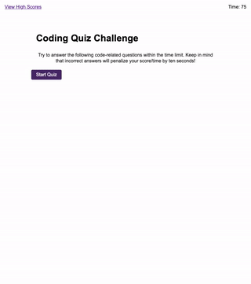

# timed-quiz

Homework assignment #4 - Coding Quiz Challenge

# What did i do?

I've created a timed quiz with 5 questions. The quiz is timed at 75 seconds. A correct answer brings the user to the next question. An incorrect brings the user to the next question and takes 10 seconds off the clock. The final user score for the game is how many seconds the user has left after they finish the quiz.

When finished the user can enter their initials and store their score in the browsers local storage

# What do i need to explain?

Some of the most recent things we have learned are not reflected in this project. Once I absorb these concepts I can re-write portions of this code.

# Github pages link

Paste in.

# Screenshot of final product

